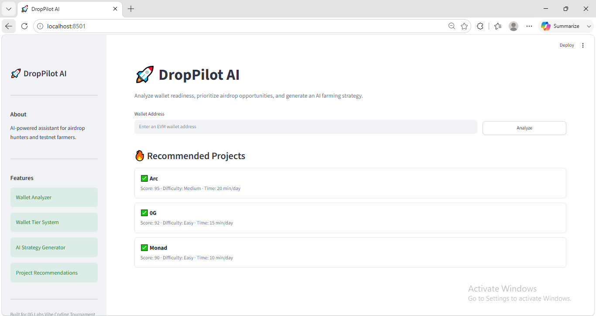
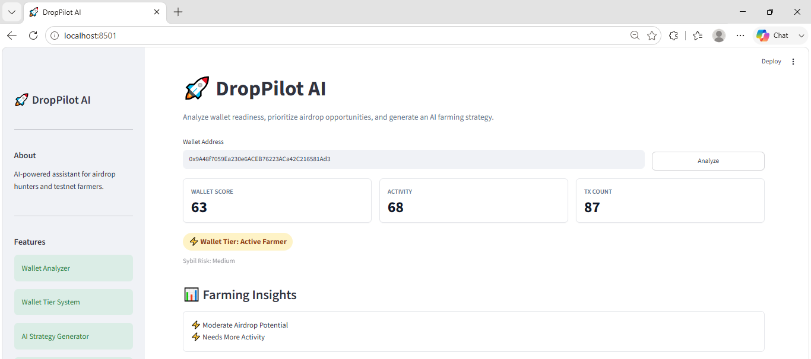
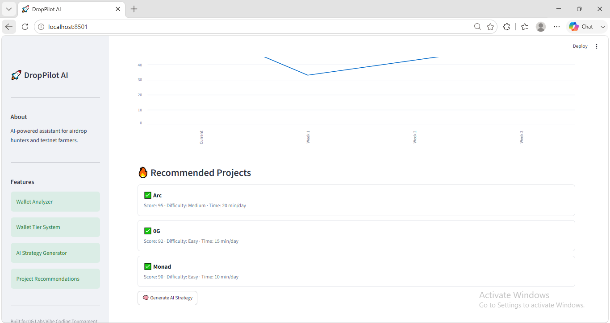
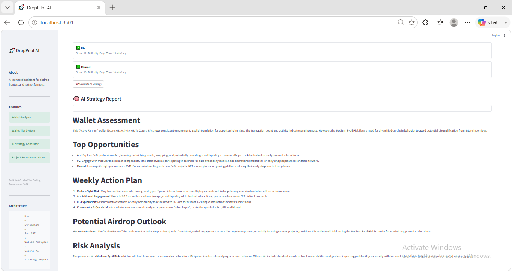

# 🚀 DropPilot AI

## AI-Powered Airdrop Intelligence Platform

DropPilot AI is an AI-powered assistant designed for airdrop hunters, testnet farmers, and Web3 explorers.

Instead of blindly interacting with dozens of ecosystems, users can analyze wallet quality, evaluate farming readiness, discover high-potential opportunities, and receive AI-generated action plans tailored to their on-chain activity.

Built for the **0G Labs Vibe Coding Tournament**.

---

## 🌐 Live Demo

### Frontend (Streamlit)

https://drop-pilot-ai-0g-labs.streamlit.app

### Backend API

https://drop-pilot-ai.onrender.com

---

## 🎬 Demo Video

https://youtu.be/ch8tTs8GIK8

---

## 🎯 Problem

Airdrop farming has become increasingly complex.

Users spend hours navigating wallets, dashboards, quests, Discord communities, and testnet campaigns without knowing:

* Is my wallet strong enough for future rewards?
* Am I wasting time on low-value opportunities?
* Which ecosystems deserve my attention?
* What actions should I take next?

Most users rely on guesswork rather than data-driven decisions.

---

## 💡 Solution

DropPilot AI transforms wallet activity into actionable farming intelligence.

The platform analyzes wallet behavior, evaluates farming readiness, identifies potential risks, recommends promising ecosystems, and generates personalized AI strategies using Gemini AI.

Instead of manually researching every project, users receive a structured plan that helps them focus on higher-value opportunities.

---

# ✨ Key Features

## 🔍 Wallet Analyzer

Analyze wallet activity and estimate farming readiness using:

* Wallet Score
* Activity Score
* Transaction Count
* Wallet Age
* Sybil Risk Assessment

---

## 🏆 Wallet Tier System

Classify wallets into farming tiers:

* 🌱 Beginner Farmer
* ⚡ Active Farmer
* 🚀 Advanced Farmer
* 🏆 Elite Farmer
* 👑 Legendary Farmer

This helps users quickly understand their farming profile.

---

## 📊 Farming Insights

Convert raw wallet metrics into actionable insights:

* High Airdrop Potential
* Moderate Airdrop Potential
* Wallet Improvement Suggestions
* Farming Readiness Evaluation

---

## 📈 Wallet Growth Projection

Visualize wallet score progression using interactive charts.

Provides a simple representation of wallet growth and readiness.

---

## 🔥 Opportunity Recommendations

Recommend promising ecosystems based on farming opportunities.

Current supported projects:

* Arc
* 0G
* Monad

Each recommendation includes:

* Opportunity Score
* Difficulty Level
* Time Commitment

---

## 🤖 Gemini AI Strategy Engine

Generate personalized farming reports using Gemini AI.

Generated reports include:

* Wallet Assessment
* Top Opportunities
* Weekly Action Plan
* Potential Airdrop Outlook
* Risk Analysis

---

## 🖥 Interactive Dashboard

Simple and intuitive interface designed for:

* Hackathon Judges
* Airdrop Hunters
* Testnet Farmers
* Web3 Researchers

---

# 🏗 Architecture

```text
User
  │
  ▼
Streamlit Frontend
  │
  ▼
FastAPI Backend
  │
  ├── Wallet Analyzer Service
  │
  ├── Recommendation Service
  │
  └── AI Strategy Engine
            │
            ▼
         Gemini AI
```

---

# 🔄 AI Workflow

### Step 1

User enters a wallet address.

### Step 2

The Streamlit dashboard sends the request to FastAPI.

### Step 3

Wallet Analyzer generates:

* Wallet Score
* Activity Score
* Transaction Count
* Wallet Tier
* Sybil Risk

### Step 4

Recommendation Engine returns suggested ecosystems.

### Step 5

AI Strategy Engine sends wallet context to Gemini AI.

### Step 6

Gemini generates a personalized farming report.

### Step 7

Results are displayed in the dashboard.

---

# 📡 API Endpoints

## GET /

Health check endpoint.

```json
{
  "project": "DropPilot AI"
}
```

---

## POST /analyze

Analyze a wallet.

Request:

```json
{
  "wallet": "0x123..."
}
```

Response:

```json
{
  "wallet_score": 85,
  "wallet_tier": "Elite Farmer",
  "activity_score": 95,
  "tx_count": 280,
  "sybil_risk": "Low"
}
```

---

## GET /recommend

Get recommended ecosystems.

---

## POST /strategy

Generate AI-powered farming strategy.

---

# 📁 Project Structure

```text
drop-pilot-ai
│
├── app
│   ├── routers
│   │   ├── analyze.py
│   │   ├── recommend.py
│   │   └── strategy.py
│   │
│   ├── services
│   │   ├── wallet_service.py
│   │   ├── recommend_service.py
│   │   └── ai_service.py
│   │
│   └── main.py
│
├── frontend
│   ├── components
│   │   ├── dashboard.py
│   │   ├── sidebar.py
│   │   └── strategy.py
│   │
│   └── app.py
│
├── docs
│   └── screenshots
│
├── requirements.txt
├── runtime.txt
├── render.yaml
└── README.md
```

---

# 📸 Screenshots

## Dashboard Overview



## Wallet Analysis



## Recommended Projects



## AI Strategy Report



---

# 🛠 Tech Stack

## Frontend

* Streamlit

## Backend

* FastAPI
* Uvicorn

## AI

* Gemini 2.5 Flash

## Data

* JSON Dataset

## Language

* Python 3.11

## Visualization

* Pandas
* Streamlit Charts

## Deployment

* GitHub
* Render
* Streamlit Cloud

---

# 🚀 Installation

## Clone Repository

```bash
git clone https://github.com/mrtrangith2023/drop-pilot-ai.git

cd drop-pilot-ai
```

---

## Create Virtual Environment

```bash
python -m venv venv
```

Windows

```bash
venv\Scripts\activate
```

macOS/Linux

```bash
source venv/bin/activate
```

---

## Install Dependencies

```bash
pip install -r requirements.txt
```

---

## Configure Environment Variables

Create a `.env` file:

```env
GEMINI_API_KEY=your_gemini_api_key
```

---

## Start Backend

```bash
uvicorn app.main:app --reload
```

---

## Start Frontend

```bash
streamlit run frontend/app.py
```

---

## Open Dashboard

```text
http://localhost:8501
```

---

# 🎮 Demo Flow

1. Enter a wallet address.
2. Click Analyze.
3. Review Wallet Score and Wallet Tier.
4. Explore Farming Insights.
5. Review Recommended Projects.
6. Click Generate AI Strategy.
7. Receive a personalized farming report generated by Gemini AI.

---

# 🗺 Roadmap

## Phase 1

* Real wallet activity integration
* Multi-chain support
* Historical wallet tracking

## Phase 2

* Daily farming planner
* Wallet watchlists
* User accounts

## Phase 3

* Advanced Sybil detection
* Live ecosystem scoring
* Personalized opportunity engine

## Phase 4

* 0G ecosystem integrations
* Community leaderboards
* AI-powered opportunity ranking

---

# 🏁 Hackathon Submission

### Project

DropPilot AI

### Category

AI-Powered Web3 Assistant

### Built For

0G Labs Vibe Coding Tournament

### Core Value

Help users spend less time guessing and more time focusing on high-value opportunities through AI-powered farming intelligence.

---

# 📄 License

MIT License

---

## 👨‍💻 Author

Tran Doan

GitHub:
https://github.com/mrtrangith2023

Building AI-powered tools for Web3, airdrop research, and crypto opportunity discovery.